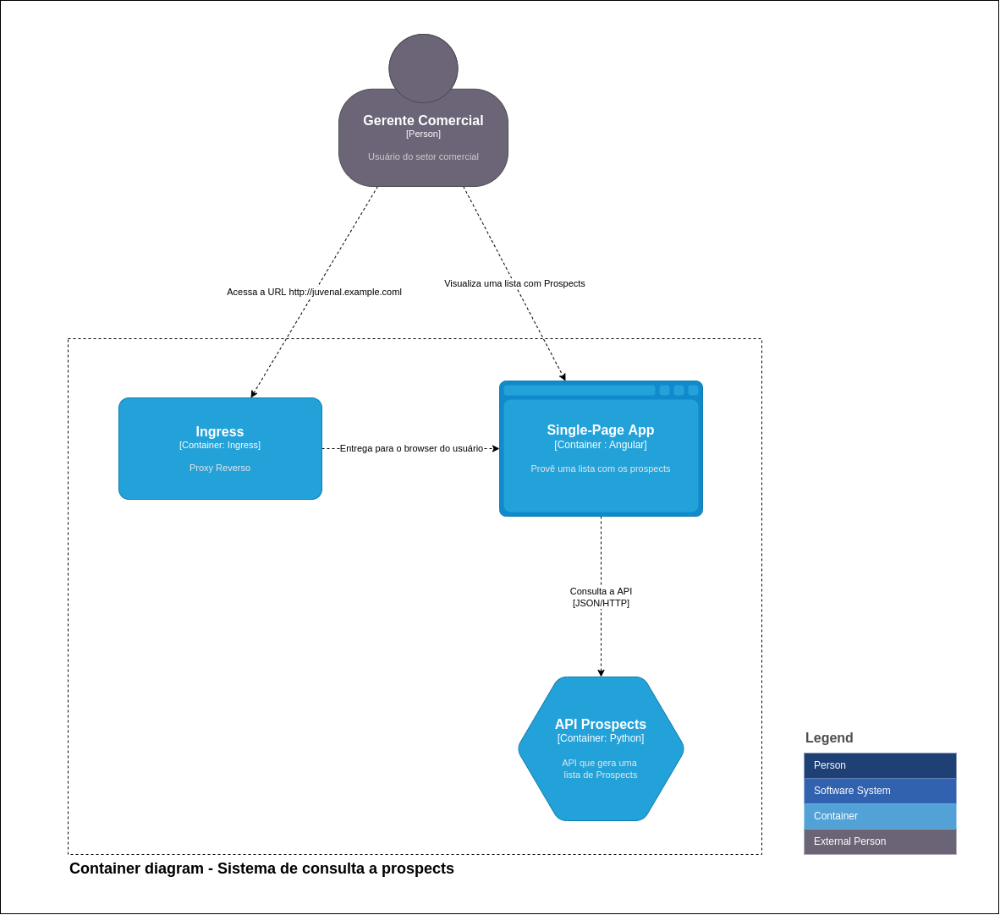

# KIND - Kubernetes Clusters para Desenvolvedores

**Autor:** Fábio Sartori


# Preparando o ambiente

## Infrastructure as Code
Para este workshop iremos provisionar uma máquina na nuvem, conforme abaixo:

| Item | Descrição |
|------|-----------|
| Nuvem | [Linode](https://www.linode.com) |
| IaC | [Terraform](https://www.terraform.io/) |
| IT Automation Tool |  [Ansible](https://www.ansible.com/) |
| Linux |  [Ubuntu](https://ubuntu.com/) |

## Criar um Access Token no Linode
* [Linode Guides - Get an API Access Token](https://www.linode.com/docs/products/tools/linode-api/guides/get-access-token/)

## Instalar Terraform CLI
* [Install Terraform](https://learn.hashicorp.com/tutorials/terraform/install-cli)

## Terraform Linode Provider
* [Linode Provider](https://registry.terraform.io/providers/linode/linode/latest/docs)


## Estrutura de diretórios do workshop
```bash
$ tree
.
├── IaC
│   ├── ansible
│   │   ├── hosts
│   │   ├── hosts.sample
│   │   └── playbook.yml
│   └── terraform
│       ├── main.tf
│       ├── terraform.auto.tfvars
│       ├── terraform.auto.tfvars.sample
```

---

## TERRAFORM - Criação da máquina virtual

A máquina virtual foi provisionada utilizando a ferramenta de [Infrastructure as Code](https://en.wikipedia.org/wiki/Infrastructure_as_code) [Terraform](https://terraform.io)

Para esta etapa, entraremos no diretório **IaC/terraform**. Estrutura abaixo listada:

```bash
$ tree
.
├── IaC
│   └── terraform
│       ├── main.tf
│       ├── terraform.auto.tfvars
│       ├── terraform.auto.tfvars.sample
```

Entre no diretório do terraform.

```bash
cd IaC/terraform
```

### Arquivo: **main.tf**

```terraform
# Autor: Fábio Sartori
# Copyright: 20220524

terraform {
  required_providers {
    linode = {
      source = "linode/linode"
      version = "1.26.1"
    }
  }
}

provider "linode" {
    token = var.shared_token
}

resource "linode_instance" "ubuntupi" {
    label = var.ubuntu_label
    image = var.ubuntu_image
    type = var.ubuntu_type
    region = var.shared_region
    root_pass = var.shared_root_pass
    authorized_keys = var.authorized_keys
    private_ip = var.shared_private_ip
    tags = var.ubuntu_tags
}

variable "shared_token" {}
    variable "region" {
    default = "us-central"
}
variable "shared_root_pass" {}
variable "shared_private_ip" {}
variable "shared_region" {}
variable "authorized_keys" {}
variable "ubuntu_tags" {}
variable "ubuntu_label" {}
variable "ubuntu_image" {}
variable "ubuntu_type" {}
```

### Arquivo **terraform.auto.tfvars**
Para criar este acruivo de variáveis, use como base o arquivo de exemplo **terraform.auto.tfvars.sample**

```properties
# Token de usuário do linode (ESTE TOKEN É SOMENTE PARA EXEMPLIFICAR, POIS NÃO É VÁLIDO)
shared_token = "00e3261a6e0d79c329445acd540fb2b07187a0dcf6017065c8814010283ac67f"
# Senha de root dos servidores
shared_root_pass = "_SENHA_DO_ROOT_"
# Região do Datacenter Linode
shared_region = "us-central"
# true se a máquina tiver ip privado
shared_private_ip = true
# Array com as chaves públicas autorizadas a logar no servidor (AS CHAVES ABAIXO SÃO SOMENTE PARA EXEMPLIFICAR, POIS NÃO SÃO VÁLIDAS)
authorized_keys = ["ssh-rsa 724c70d82400c99516c0b9513125c14bfd995fecfb7cc9ab757943459c0397fff92bbc8e1b9facbbaec8f27e0426cb4f7def7c6c83df3f3955373729a366303b= juvenal@bla"]
# Tags para identificar o servidor
ubuntu_tags = ["workshop","kind"]
# Label para identificar o servidor
ubuntu_label = "ubuntu_pi"
# Imagem de Linux para a criação do servidor
ubuntu_image = "linode/ubuntu20.04"
# Tipo do linode com 4GB de RAM (verifique os custo $$ antes)
ubuntu_type = "g6-standard-4"

```

### Inicializando o terraform

```bash
terraform init
```

Retorno

```text
Initializing the backend...
Initializing provider plugins...
- Reusing previous version of linode/linode from the dependency lock file
- Using previously-installed linode/linode v1.26.1

Terraform has been successfully initialized!
```

### Validando o plano de execução do terraform

```bash
terraform plan
```
Retorno

```text
Terraform used the selected providers to generate the following execution plan. Resource
actions are indicated with the following symbols:
  + create
  .
  .
  .
  Plan: 1 to add, 0 to change, 0 to destroy.
```

### Aplicando o plano de execução

Para criar a máquina virtual, aplique o plano de execução, conforme abaixo.

```bash
terraform apply
```
Retorno
```texta
Terraform used the selected providers to generate the following execution plan. Resource
actions are indicated with the following symbols:
  + create

Terraform will perform the following actions:

  # linode_instance.ubuntupi will be created
  + resource "linode_instance" "ubuntupi" {
  .
  .
  .
Do you want to perform these actions?
  Terraform will perform the actions described above.
  Only 'yes' will be accepted to approve.

  Enter a value:  
```

Confirme, digitando **yes** e pressionando **<ENTER\>**

> **Ao final da execução, você deverá receber uma mensagem conforme abaixo:**
> .
> .
> linode_instance.ubuntupi: Creation complete after 55s [id=36484787]
> Apply complete! Resources: 1 added, 0 changed, 0 destroyed.

### Listando os dados da Máquina Virtual

```bash
terraform show
```

### Listando IP público da Máquina Virtual

Nos exemplos, **xxx.xxx.xxx.xxx** representa o IP externo do servidor.

```bash
terraform show -json | jq .values.root_module.resources[0].values.ip_address
xxx.xxx.xxx.xxx
```

---
## Ansible - Configuração da máquina virtual

Arquivo **playbook.yaml**

```yaml
# Autor: Fábio Sartori
# Copyright: 20220525

- hosts: ubuntukind
  become: yes
  tasks:
    - name: Alterando o hostname para ubuntukind
      hostname:
        name: ubuntukind
      become: yes

    - name: Instalando Docker
      apt:
        name: ["docker.io", "docker-compose"]
        state: present
        update_cache: yes
      become: yes

    - name: Desabilidando autenticacao com senha
      lineinfile: dest=/etc/ssh/sshd_config
        regexp='^#PasswordAuthentication no|^#PasswordAuthentication yes|^PasswordAuthentication yes'
        line="PasswordAuthentication no"
        state=present
        backup=yes
      notify:
        - restart ssh

    - name: Habilitando autenticacao por chave publica
      lineinfile: dest=/etc/ssh/sshd_config
        regexp='^#PubkeyAuthentication no|^#PubkeyAuthentication yes|^PubkeyAuthentication no'
        line="PubkeyAuthentication yes"
        state=present
        backup=yes
      notify:
        - restart ssh
  handlers:
    - name: restart ssh
      service: name=sshd
        state=restarted

```

Arquivo de inventário **hosts**

```toml
[ubuntukind]
xxx.xxx.xxx.xxx
```

Para aplicar o playbook execute o comando abaixo:

```bash
ansible-playbook -i hosts -u root playbook.yml
```

---

# [Kind](https://kind.sigs.k8s.io/)

Ferramenta capaz de executar clusters locais de Kubernetes usando nó de containers Docker.

Kind consiste em:

* **Pacotes GO:** Responsáveis pela criação de clusters, build de imagens, etc
* **Kind CLI:** Utilitário de linha de comando para administrar o cluster kind
*  **Image Docker:** Serve para executar o systemd, k8s, etc;

## Arquitetura


## Pré-requisitos

| Requisito | Tipo | Obs |
|-----------|------|-----------|
| docker | Software | https://docs.docker.com/get-docker/ |
| kind CLI | Software | https://kind.sigs.k8s.io/docs/user/quick-start#installing-from-release-binaries |
| kubectl | Software | https://kubernetes.io/docs/tasks/tools/ |
| Memória Mínima | Hardware | 6GB RAM Dedicado |
| Memória Recomendado | Hardware | 8GB RAM |
|  CPU | Hardware | 4 Cores no mínimo |


## Instalação Kind CLI

Para instalar o Kind CLI, execute os comandos abaixo:

```bash
curl -Lo ./kind https://kind.sigs.k8s.io/dl/v0.14.0/kind-linux-amd64
chmod +x ./kind
mv ./kind /usr/bin/kind
```

Caso a execução **não seja com o usuário root**, é recomendado lhe conceder permissões para acesso ao socket do docker.

No exemplo abaixo, vamos supor que o usuário **juvenal** precisa ter acesso ao docker. Execute o comando abaixo no terminal:

```bash
sudo usermod -a -G docker juvenal
```

## Instalação do kubectl

1. Atualize o catálogo de pacotes **apt** e instale os pacotes necessários para utilizar o repositório **apt** do Kubernetes:
    
```bash
sudo apt-get update
sudo apt-get install -y apt-transport-https ca-certificates curl
```
    
2. Faça download da chave pública do Google Cloud:
    
```bash
sudo curl -fsSLo /usr/share/keyrings/kubernetes-archive-keyring.gpg https://packages.cloud.google.com/apt/doc/apt-key.gpg
```
    
3. Adicione o repositório **apt** do Kubernetes:
    
```bash
echo "deb [signed-by=/usr/share/keyrings/kubernetes-archive-keyring.gpg] https://apt.kubernetes.io/ kubernetes-xenial main" | sudo tee /etc/apt/sources.list.d/kubernetes.list
```
    
4. Atualize o catálogo de pacotes **apt** com o novo repositório e instale o **kubectl**
    
```shell
sudo apt-get update
sudo apt-get install -y kubectl
```

5. Teste o **kubectl**

```shell
kubectl
.
.
.
Usage:
  kubectl [flags] [options]

Use "kubectl <command> --help" for more information about a given command.
Use "kubectl options" for a list of global command-line options (applies to all
commands).
```

## Inicializar o Docker

Para seguir com este tutorial, inicialize o serviço do docker caso não esteja no ar

```
sudo systemctl start docker
```

---

## Principais comandos do Kind CLI

### Criação de cluster

#### Sem script
```bash
kind create cluster --name <NOME_DO_CLUSTER>
```

#### Customizado com uso de script YAML

Para customizar a criação de um cluster, é necessário criar um arquivo no formato [YAML](https://yaml.org) seguindo, é claro, convenções do kubernetes, como versionamento, etc.

As customizações vão desde o nome do cluster, passando por configurações de runtime, redes, port mapping, etc.

Segue o link para maiores referências sobre as configurações possiveis.

[https://pkg.go.dev/sigs.k8s.io/kind/pkg/apis/config/v1alpha4](https://pkg.go.dev/sigs.k8s.io/kind/pkg/apis/config/v1alpha4)

---

### Cluster pronto para Ingress.

1. Criação de um de um cluster kind (single-node) contendo a configuração do cluster e pronto para o **ingress** com mapeamentos nas **portas 80 e 443**


Crie um arquivo chamado **cluster-config.yaml** para um **cluster single-node** com o conteúdo abaixo:

```yaml
kind: Cluster
apiVersion: kind.x-k8s.io/v1alpha4
name: cons-prosp
nodes:
- role: control-plane
  kubeadmConfigPatches:
  - |
	kind: InitConfiguration
	nodeRegistration:
	  kubeletExtraArgs:
		node-labels: "ingress-ready=true"
  extraPortMappings:
  - containerPort: 80
	hostPort: 80
	protocol: TCP
  - containerPort: 443
	hostPort: 443
	protocol: TCP
```

Ou para um **cluster multi-node**

```yaml
kind: Cluster
apiVersion: kind.x-k8s.io/v1alpha4
name: cons-prosp
nodes:
- role: control-plane
  kubeadmConfigPatches:
  - |
    kind: InitConfiguration
    nodeRegistration:
      kubeletExtraArgs:
        node-labels: "ingress-ready=true"
  extraPortMappings:
  - containerPort: 80
    hostPort: 80
    protocol: TCP
  - containerPort: 443
    hostPort: 443
    protocol: TCP
- role: worker
- role: worker
```

IMPORTANTE: A configuração do node-labels

## Criação do cluster

Aplique o script do passo anterior e crie o cluster

```bash
kind create cluster --config cluster-config.yaml
```

A partir deste momento, o cluster está pronto para a instalação de um ingress controller.

## Instalação do Ingress Controller

```bash
kubectl apply -f https://raw.githubusercontent.com/kubernetes/ingress-nginx/master/deploy/static/provider/kind/deploy.yaml
```

Executando Aguardando a conclusão 

```bash
kubectl wait --namespace ingress-nginx \
  --for=condition=ready pod \
  --selector=app.kubernetes.io/component=controller \
  --timeout=90s
```

## Listando a arquitetura do cluster

Neste exemplo o **cons-prosp**, é o nome do cluster criado no Kind

### Kind Cluster

```bash
kind get clusters
cons-prosp
```

### Listando o Container Docker referente ao Kind Cluster

```bash
kubectl get nodes | grep "cons-prosp"                                                            
NAME                                   STATUS   ROLES                  AGE   VERSION
cons-prosp-control-plane   Ready    control-plane,master   50m   v1.21.1
```

### Listar o IP do cluster para acesso externo

```bash
docker container inspect cons-prosp-control-plane --format '{{ .NetworkSettings.Networks.kind.IPAddress }}'
```


## Operações com contextos e múltiplos clusters

### Criando um cluster com outra versão do kubernetes

```yaml
kind: Cluster
apiVersion: kind.x-k8s.io/v1alpha4
name: versao-antiga
nodes:
- role: control-plane
  image: kindest/node:v1.19.16@sha256:d9c819e8668de8d5030708e484a9fdff44d95ec4675d136ef0a0a584e587f65c
```

### Listar contexto atual

```bash
kubectl config current-context
kind-versao-antiga
```

### Listar todos contextos

```bash
kubectl config get-contexts
kubectl config get-contexts
CURRENT   NAME                 CLUSTER              AUTHINFO             NAMESPACE
*         kind-cons-prosp      kind-cons-prosp      kind-cons-prosp      
          kind-versao-antiga   kind-versao-antiga   kind-versao-antiga
```

### Trocar de contexto

```bash
kubectl config use-context kind-cons-prosp                                     kind-cons-prosp
```
---

## Exportando os logs do cluster

```bash
kind export logs --name cons-prosp /tmp/logs
Exporting logs for cluster "cons-prosp" to:
/tmp/logs


ls /tmp/logs 
cons-prosp-control-plane  cons-prosp-control-plane2  cons-prosp-worker  cons-prosp-worker2  docker-info.txt  kind-version.txt
```

---

## Gerando um arquivo kubeconfig de determinado de um cluster

```bash
kind get kubeconfig --name cons-prosp > ARQUIVO_KUBECONFIG
```

---

## Excluindo um cluster

```bash
kubectl config use-context kind-cons-prosp                                     kind-cons-prosp
```

---

## Trabalhando Offline
Para quem for trabalhar em locais sem acesso a internet, é bastante interessante ter as imagens dos nós de k8s localmente, para que assim seja possível criar novos clusters, se necessário.

### Verifique a versão instalada do kind cli
	
```bash
kind --version
kind version 0.14.0
```

### Acesse a página de releases do kind e verifique as imagens compatíveis com a sua versão kind cli

[https://github.com/kubernetes-sigs/kind/releases](https://github.com/kubernetes-sigs/kind/releases)

### Faça download da imagem de kind_node na versão escolhida
Para exemplificar, usaremos a versão 1.24.0

Faça pull da versão: Não esqueça de adicionar na versão da tag, o digest **sha512...**

```bash
docker pull kindest/node:v1.24.0@sha256:0866296e693efe1fed79d5e6c7af8df71fc73ae45e3679af05342239cdc5bc8e
```

**DICA:** Salve a imagem em disco, para ter um becape, além do registry local.

```bash
docker save kindest/node:v1.24.0@sha256:0866296e693efe1fed79d5e6c7af8df71fc73ae45e3679af05342239cdc5bc8e | gzip > kind.v1.24.0.tar.gz
```

Se você não tiver a image carregada no seu registro local, para o caso de terr somente o arquivo **kind.v1.24.0.tar.gz** salvo. Imaginando que tenha recebido o arquivo de um colega.

```bash
docker load -i kind.v1.24.0.tar.gz
```

Após ter a imagem carregada no registry local, crie uma TAG para ela.

```bash
docker image tag kindest/node:v1.24.0@sha256:0866296e693efe1fed79d5e6c7af8df71fc73ae45e3679af05342239cdc5bc8e kindest/node:v1.24.0
```

Agora, quando for criar um clusster com esta versão, basta usar o parâmetro **--image**, caso use a linha de comando.

```bash
kind create cluster --image kindest/node:v1.24.0
```

Ou adicione ao script de criação do cluster

```yaml
kind: Cluster
apiVersion: kind.x-k8s.io/v1alpha4
name: versao-antiga
nodes:
- role: control-plane
  image: kindest/node:v1.24.0
  kubeadmConfigPatches:
  - |
    kind: InitConfiguration
    nodeRegistration:
      kubeletExtraArgs:
        node-labels: "ingress-ready=true"
  extraPortMappings:
  - containerPort: 80
    hostPort: 80
    protocol: TCP
  - containerPort: 443
    hostPort: 443
    protocol: TCP
```


---

## Random Prospects Generator API  
API geradora aleatória de prospects. 

### Exemplo prático

Para exemplificar, iremos criar o seguinte cenário

#### C4 - Level 1


#### C4 - Level 2



#### C4 - Level 3


  
#### Variáveis .env  
  
| Variável | Descrição | Exemplo |
|----------|-----------|---------|  
| PORT | Número da porta da API | 5000 |  
| ENVIRONMENT | Ambiente no qual a API está executando | development |  
| PROSPECTS_ROUTE | Rota para listar os prospects | /prospects |  
  
  
#### Operações  
  
##### Listar Prospects  
Por padrão, serão retornados 50 registros FAKE  
  
**GET /prospects**  
**Content-type/application/json**  
**Exemplo de retorno:**  

```json
[
  {
    "name": "Sra. Maria Fernanda Costela",
    "mail": "costelamaria-fernanda@hotmail.com",
    "phone_number": "61 3949-7553"
  },
  {
    "name": "Danilo Vieira",
    "mail": "cunhaluiz-fernando@hotmail.com",
    "phone_number": "+55 61 4916-6943"
  }
]
```
---

#### K8S Configmap File

Arquivo **configmap.yaml**

```yaml
{
  "apiVersion": "v1",
  "kind": "ConfigMap",
  "metadata": {
    "name": "random-prospects-genetator-api-config",
    "labels": {
      "app": "random-prospects-genetator-api"
    }
  },
  "data": {
    "PORT": "5000",
    "ENVIRONMENT": "development",
    "PROSPECTS_ROUTE": "/prospects"
  }
}
```

Aplique o script com o comando abaixo:

```bash
kubectl apply -f https://raw.githubusercontent.com/kiosanim/kind-kubernetes-clusters-para-desenvolvedores-workshop/master/random-prospects-generator-api/k8s/configmap.yaml
```

#### K8S Deployment File

Arquivo **deployment.yaml**

```yaml
apiVersion: apps/v1
kind: Deployment
metadata:
  name: "random-prospects-genetator-api"
spec:
  selector:
    matchLabels:
      app: "random-prospects-genetator-api"
  replicas: 1
  template:
    metadata:
      labels:
        app: "random-prospects-genetator-api"
    spec:
      containers:
        - name: "random-prospects-genetator-api"
          image: "fabiosartori/random-prospects-genetator-api:0.1.1"
          resources:
            limits:
              memory: 128Mi
              cpu: 256m
          env:
            - name: "PORT"
              value: "5000"
            - name: "ENVIRONMENT"
              value: "development"
            - name: "PROSPECTS_ROUTE"
              value: "/prospects"
          envFrom:
            - configMapRef:
                name: "random-prospects-genetator-api-config"
          ports:
            - containerPort: 8000
```

Aplique o script com o comando abaixo:

```bash
kubectl apply -f https://raw.githubusercontent.com/kiosanim/kind-kubernetes-clusters-para-desenvolvedores-workshop/master/random-prospects-generator-api/k8s/deployment.yaml
```

#### K8S Service File

Arquivo **service.yaml**

```yaml
kind: Service  
apiVersion: v1  
metadata:  
  name: random-prospects-genetator-api-svc  
spec:  
  selector:  
    app: random-prospects-genetator-api  
  ports:  
  - port: 5000
```

Aplique o script com o comando abaixo:

```bash
kubectl apply -f https://raw.githubusercontent.com/kiosanim/kind-kubernetes-clusters-para-desenvolvedores-workshop/master/random-prospects-generator-api/k8s/service.yaml
```

#### K8S Ingress Rules File

Arquivo **ingress_rules.yaml**

```yaml
apiVersion: networking.k8s.io/v1  
kind: Ingress  
metadata:  
  name: random-prospects-genetator-api-ingress  
spec:  
  rules:  
    - host: juvenal.example.com  
      http:  
        paths:  
          - pathType: ImplementationSpecific  
            path: "/prospects"  
            backend:  
              service:  
                name: random-prospects-genetator-api-svc  
                port:  
                  number: 5000
```

Aplique o script com o comando abaixo:

```bash
kubectl apply -f https://raw.githubusercontent.com/kiosanim/kind-kubernetes-clusters-para-desenvolvedores-workshop/master/random-prospects-generator-api/k8s/ingress_rules.yaml
```

### Testando a regra do ingress

#### Cadastro no /etc/hosts (se não tiver DNS)

Adicione a linha abaixo no arquivo /etc/hosts

```bash
172.18.0.2	juvenal.example.com
```

#### Testando a configuração

```bash
curl -X GET http://juvenal.example.com/prospects
[
  {
    "name": "Luiza Jesus",
    "mail": "lauramendes@ig.com.br",
    "phone_number": "+55 31 8511-6848"
  },
  {
    "name": "Maitê Porto",
    "mail": "rezendeluna@bol.com.br",
    "phone_number": "41 5822-4474"
  }
  .
  .
  .
]
```

#### Aumentando o número de instâncias

```bash
kubectl scale --replicas 2 deployment/random-prospects-genetator-api
```

Como resultado, teremos os pods distribuídos entre as instâncias.

```bash
kubectl get pods -o wide                                            
```
Como resultado, poderá perceber que existem instâncias nas duas instâncias do cluster.


---


## IMPORTANTE
**NUNCA USE O KIND EM AMBIENTES DE PRODUÇÃO, POIS O KIND NÃO POSSUI VÊM COM AS MELHORES PRÁTICAS DE SEGURANÇA, COMO UM CLUSTER REAL.**

## Referências do kubectl

[https://kubernetes.io/docs/reference/generated/kubectl/kubectl-commands](https://kubernetes.io/docs/reference/generated/kubectl/kubectl-commands)

## Material do Workshop

[https://github.com/kiosanim/kind-kubernetes-clusters-para-desenvolvedores-workshop](https://github.com/kiosanim/kind-kubernetes-clusters-para-desenvolvedores-workshop)